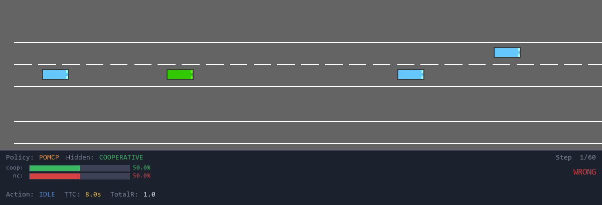
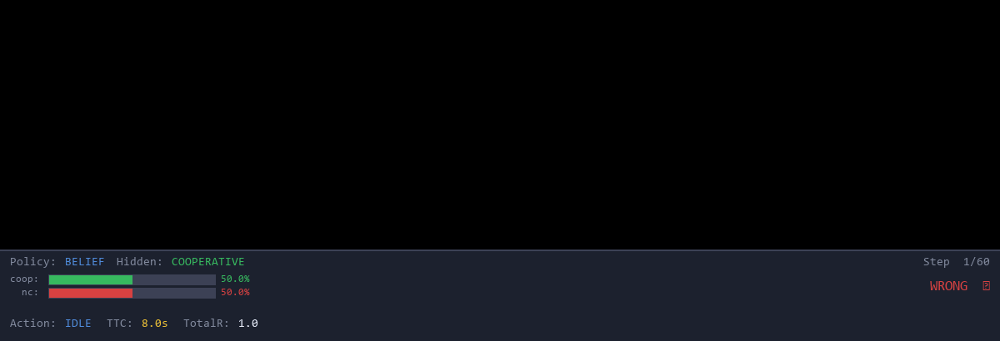
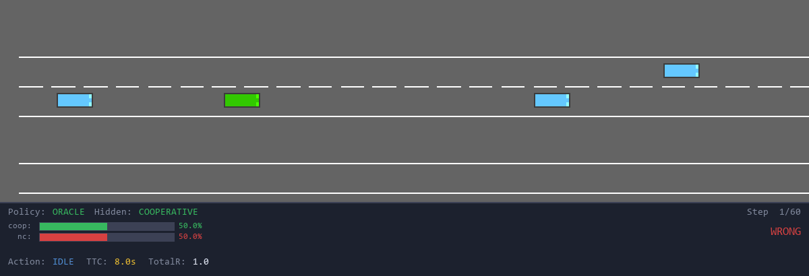
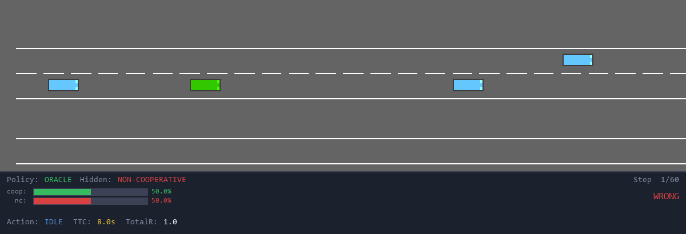
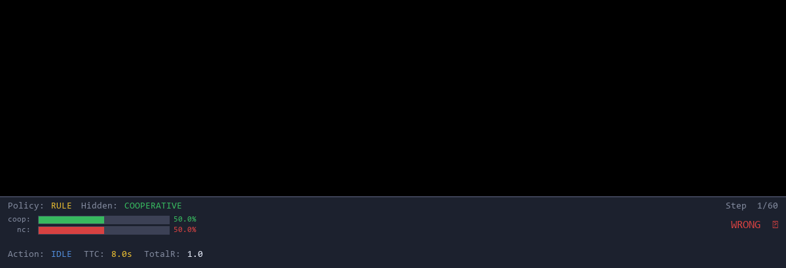
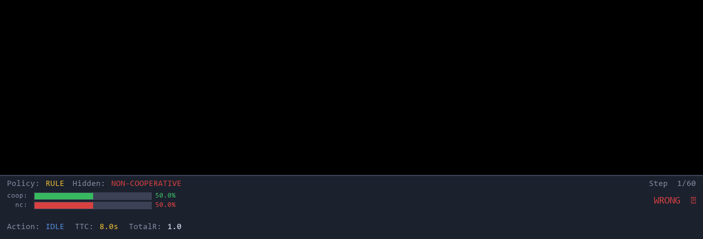
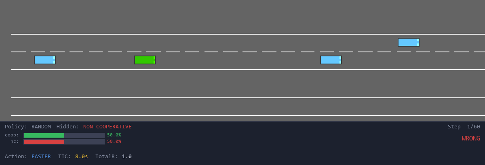

# HiddenCourtesyMerge-Sim

HiddenCourtesyMerge-Sim is a controlled highway merge benchmark for studying
belief-based planning when another driver's courtesy type is hidden.

The core question is simple: an ego vehicle must negotiate with a merging
vehicle, but it cannot directly observe whether that vehicle will yield. The
benchmark injects a binary hidden courtesy variable into `highway-env` `merge-v0`
through IDM/MOBIL behavior parameters, then evaluates whether policies can infer
that hidden type from motion cues and use it for safer decisions.

This is not a real-world driving claim. It is a reproducible simulation testbed
for asking where belief estimation helps, where it fails, and when online
planning over uncertainty is more useful than a hand-designed belief-conditioned
rule.

## What This Project Tests

The benchmark compares five policies on matched episodes:

| Policy | What it represents |
| --- | --- |
| `random_policy` | Lower-bound sanity check. |
| `rule_policy` | Courtesy-ignorant rule with a fixed prior. |
| `belief_policy` | Bayesian courtesy filter plus the same heuristic action table. |
| `oracle_policy` | Oracle-heuristic that sees the true courtesy label, but still uses the heuristic action table. |
| `pomcp_policy` | Online Monte Carlo POMDP planner using the belief state. |

The main scientific finding is diagnostic: hidden courtesy is decision-relevant,
but the released Bayesian heuristic does not significantly beat the rule policy
because the belief is least reliable during the early interaction window where
the ego must act. POMCP performs best in the reported evaluation because it plans
over uncertainty rather than only reacting to the current belief through a fixed
action table.

An analogy: the rule policy drives like someone using one fixed habit, the belief
policy tries to guess whether the merging driver is polite before acting, the
oracle-heuristic is told the answer but can still only use the same limited habit,
and POMCP actively simulates possible futures before choosing.

## Visual Examples

Each GIF shows one matched merge scenario under one policy and one hidden
courtesy type.

| Policy | Cooperative | Non-cooperative |
| --- | --- | --- |
| POMCP |  |  |
| Belief |  |  |
| Oracle-heuristic |  |  |
| Rule |  |  |
| Random |  |  |

Regenerate the GIFs with:

```bash
python src/record_gifs.py
```

## Repository Layout

| Path | Purpose |
| --- | --- |
| `src/generate_hidden_courtesy_merge_dataset.py` | Generates the controlled hidden-courtesy dataset. |
| `src/calibrate_observation_model.py` | Fits the Bayesian observation model. |
| `src/evaluate_policies.py` | Runs matched policy evaluations, including POMCP. |
| `src/pomcp_policy.py` | Compact POMCP planner used by evaluation and visualization. |
| `src/sim_visualizer.py` | Interactive simulator visualizer for all five policies. |
| `src/record_gifs.py` | Renders the GIF gallery in `gifs/`. |
| `src/run_confirmatory_eval.py` | Runs the high-powered heuristic confirmatory evaluation. |
| `src/run_noise_stress_sweep.py` | Runs observation-noise robustness checks. |
| `src/run_belief_gain_sweep.py` | Tests whether stronger belief-to-action gain fixes the null result. |
| `src/analyze_observation_uncertainty.py` | Bootstraps observation-model parameter uncertainty. |
| `src/analyze_generating_policy_bias.py` | Checks trajectory-distribution bias from dataset generation policy. |
| `src/make_tier1_tables.py` | Rebuilds paper-ready LaTeX result tables from experiment outputs. |

Generated datasets and experiment outputs are intentionally ignored by Git. The
scripts, source tables, figures, and small GIF visualizations are the commit
targets.

## Setup

The project was developed with Python 3.13 on Windows. Install dependencies from
the pinned requirements file:

```bash
python -m pip install -r requirements.txt
```

## Quick Visualizer

Run the interactive visualizer:

```bash
python src/sim_visualizer.py
```

Controls:

| Key | Action |
| --- | --- |
| `P` | POMCP policy |
| `B` | Belief policy |
| `O` | Oracle-heuristic policy |
| `R` | Rule policy |
| `N` | Random policy |
| `C` | Force cooperative merge vehicle |
| `X` | Force non-cooperative merge vehicle |
| `Z` | Randomize courtesy type |
| `SPACE` | Pause or resume |
| `ENTER` | Start a new episode |

## Reproduce Core Results

Run commands from the repository root.

1. Calibrate the observation model:

```bash
python src/calibrate_observation_model.py --episodes 60 --seed 999 --output observation_model.json
```

2. Generate the canonical dataset:

```bash
python src/generate_hidden_courtesy_merge_dataset.py --episodes 3000 --seed 7 --output HiddenCourtesyMerge-Sim-cleanobs
```

3. Evaluate heuristic policies on matched episodes:

```bash
python src/evaluate_policies.py --episodes 300 --seed 17 --output eval_final_v6_cleanobs --policies belief_policy rule_policy random_policy oracle_policy
```

4. Evaluate POMCP on the same matched episode indices:

```bash
python src/evaluate_policies.py --episodes 300 --seed 17 --output pomcp_300ep_100sims --policies pomcp_policy --pomcp-sims 100 --pomcp-horizon 10
```

5. Rebuild paper-ready result tables:

```bash
python src/make_tier1_tables.py
```

## Reproduce Robustness Checks

POMCP rollout-trigger isolation:

```bash
python src/evaluate_policies.py --episodes 300 --seed 17 --output pomcp_heuristic_rollout_300ep --policies pomcp_policy --pomcp-sims 100 --pomcp-horizon 10 --pomcp-rollout-d-thresh 8 --pomcp-rollout-ttc-thresh 3
```

Closed-loop full-covariance belief evaluation:

```bash
python src/evaluate_policies.py --episodes 300 --seed 17 --output eval_fullcov_300 --belief-model full_cov --policies belief_policy rule_policy oracle_policy random_policy
```

Observation-noise stress test:

```bash
python src/run_noise_stress_sweep.py --episodes 300 --seed 17 --output noise_stress_sweep --scales 0.25 0.50 1.00 2.00 4.00 --policies rule_policy belief_policy oracle_policy pomcp_policy
```

High-powered heuristic confirmatory evaluation:

```bash
python src/run_confirmatory_eval.py --episodes 1960 --seed 17 --output eval_confirmatory_1960 --policies belief_policy rule_policy oracle_policy random_policy
```

Belief-gain sweep:

```bash
python src/run_belief_gain_sweep.py --episodes 300 --seed 17 --output belief_gain_sweep --gains 0.05 0.10 0.185 0.30 0.50
```

Observation-parameter bootstrap uncertainty:

```bash
python src/analyze_observation_uncertainty.py --bootstraps 2000
```

Generating-policy bias check:

```bash
python src/generate_hidden_courtesy_merge_dataset.py --episodes 3000 --seed 7 --policy-name belief_policy --output dataset_belief_ego
python src/generate_hidden_courtesy_merge_dataset.py --episodes 3000 --seed 7 --policy-name rule_policy --output dataset_rule_ego
python src/analyze_generating_policy_bias.py --source dataset_belief_ego --target dataset_rule_ego --output generating_policy_bias_analysis
```

## Reproducibility Notes

The important seeds are separated by role:

| Seed | Use |
| --- | --- |
| `999` | Observation-model calibration. |
| `7` | Dataset generation. |
| `17` | Matched policy evaluation. |
| `42` | GIF recording scenarios. |

The hidden courtesy label is saved for analysis but is not observed by
`belief_policy` or `pomcp_policy` during decision-making. `oracle_policy` is the
only structured baseline that receives the true label, and it is reported as an
oracle-heuristic rather than an optimal oracle.

Large generated folders such as `eval_*`, `pomcp_*`, dataset folders, and stress
test outputs are ignored by `.gitignore` to keep the repository small. Recreate
them with the commands above when reproducing the project.
